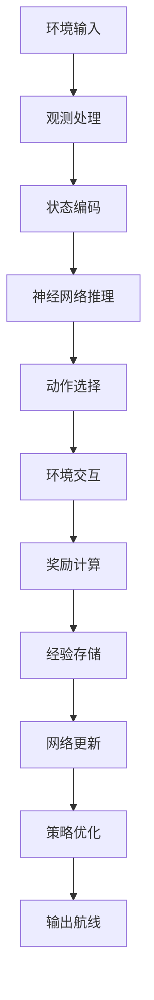

# 🔄 多智能体无人机路径规划数据流分析

## 📊 完整数据流概览



---

## 🎯 1. 输入数据层 (Input Layer)

### 1.1 环境原始输入
```python
# 环境配置输入
env_config = {
    'map_size': (50, 50),           # 地图尺寸 50×50
    'num_agents': 3,                # 智能体数量
    'num_targets': 5,               # 目标数量  
    'sensor_range': 3,              # 传感器范围
    'communication_range': 10,      # 通信范围
    'max_steps': 1000              # 最大步数
}

# 任务初始状态
initial_state = {
    'agent_positions': [(5,5), (15,15), (25,25)],  # 智能体初始位置
    'target_positions': [(10,30), (40,20), ...],   # 目标真实位置(隐藏)
    'map_coverage': zeros(50, 50),                  # 初始覆盖图全0
    'discovered_targets': [],                       # 已发现目标列表
    'step_count': 0                                # 当前步数
}
```

### 1.2 实时传感器输入
```python
# 每个时间步的传感器数据
sensor_data = {
    'agent_0': {
        'position': (x, y, altitude),       # 当前位置
        'local_map': sensor_observation,    # 局部观测地图
        'targets_detected': target_list,    # 检测到的目标
        'battery_level': 0.85,             # 电池电量
        'velocity': (vx, vy, vz)           # 当前速度
    },
    'agent_1': {...},
    'agent_2': {...}
}
```

---

## 🔄 2. 观测处理层 (Observation Processing)

### 2.1 多通道观测构建
```python
def build_observation(agent_id, env_state):
    """构建13通道观测向量"""
    
    # 基础9通道
    base_channels = [
        env_state.coverage_map,           # Ch0: 全局覆盖图
        env_state.agent_positions,        # Ch1: 智能体位置
        env_state.discovered_targets,     # Ch2: 已发现目标
        env_state.obstacle_map,           # Ch3: 障碍物地图
        env_state.boundary_map,           # Ch4: 边界约束
        env_state.communication_graph,    # Ch5: 通信连接
        env_state.battery_levels,         # Ch6: 电量状态
        env_state.velocity_field,         # Ch7: 速度场
        env_state.time_encoding          # Ch8: 时间编码
    ]
    
    # 区域通道 (3通道)
    region_channels = [
        calculate_region_priority(region_1),  # Ch9: 区域1优先级
        calculate_region_priority(region_2),  # Ch10: 区域2优先级  
        calculate_region_priority(region_3)   # Ch11: 区域3优先级
    ]
    
    # 前沿通道 (1通道)
    frontier_channel = detect_frontiers(env_state.coverage_map)  # Ch12: 前沿边界
    
    # 合并为13通道观测
    observation = concatenate([
        base_channels,     # 9 channels
        region_channels,   # 3 channels
        frontier_channel   # 1 channel
    ])  # Total: 13 channels
    
    return observation  # Shape: (13, 50, 50)
```

### 2.2 前沿检测处理
```python
def detect_frontiers(coverage_map):
    """形态学前沿检测"""
    
    # 1. 二值化已探索区域
    explored = (coverage_map > 0.5).astype(float)
    
    # 2. 形态学膨胀
    kernel = np.ones((3, 3))
    dilated = binary_dilation(explored, kernel)
    
    # 3. 计算前沿边界
    frontier = dilated & (~explored)
    
    # 4. 距离变换
    distance_to_frontier = distance_transform_edt(~frontier)
    
    return frontier, distance_to_frontier
```

---

## 🧠 3. 神经网络推理层 (Neural Network Inference)

### 3.1 Actor网络前向传播
```python
class ActorNetwork(nn.Module):
    def forward(self, observation):
        """Actor网络推理过程"""
        
        # 输入: (batch_size, 13, 50, 50)
        # 卷积特征提取
        conv_features = self.conv_layers(observation)  # -> (batch, 256, 6, 6)
        
        # 全局池化
        global_features = self.global_pool(conv_features)  # -> (batch, 256)
        
        # 全连接层
        hidden = self.fc_layers(global_features)  # -> (batch, 128)
        
        # 动作概率输出
        action_logits = self.action_head(hidden)  # -> (batch, 27)
        action_probs = softmax(action_logits)
        
        return action_probs
```

### 3.2 Critic网络价值估计
```python
class CriticNetwork(nn.Module):
    def forward(self, joint_observation, joint_action):
        """Critic网络价值估计"""
        
        # 联合观测处理
        joint_obs = concatenate(all_agent_observations)  # (batch, 13*N, 50, 50)
        joint_act = concatenate(all_agent_actions)       # (batch, 27*N)
        
        # 特征提取
        obs_features = self.obs_encoder(joint_obs)
        act_features = self.act_encoder(joint_act)
        
        # 价值估计
        value = self.value_head(obs_features + act_features)  # -> (batch, 1)
        
        return value
```

---

## ⚡ 4. 动作选择层 (Action Selection)

### 4.1 概率动作采样
```python
def select_action(action_probs, exploration_mode=True):
    """动作选择机制"""
    
    if exploration_mode:
        # 训练阶段: 概率采样
        action = np.random.choice(27, p=action_probs)
    else:
        # 测试阶段: 贪心选择
        action = np.argmax(action_probs)
    
    # 动作解码: 27维 -> (x, y, z)
    x_move = action // 9          # {-1, 0, 1}
    y_move = (action % 9) // 3    # {-1, 0, 1}  
    z_move = action % 3           # {-1, 0, 1}
    
    return (x_move, y_move, z_move)
```

### 4.2 动作合法性检查
```python
def validate_action(current_pos, action, env_constraints):
    """动作合法性验证"""
    
    new_pos = current_pos + action
    
    # 边界检查
    if not (0 <= new_pos[0] < map_size[0] and 
            0 <= new_pos[1] < map_size[1] and
            0 <= new_pos[2] < max_altitude):
        return False, current_pos
    
    # 障碍物检查
    if obstacle_map[new_pos[0], new_pos[1]] == 1:
        return False, current_pos
    
    # 碰撞检查
    for other_agent in other_agents:
        if distance(new_pos, other_agent.pos) < min_distance:
            return False, current_pos
    
    return True, new_pos
```

---

## 🎯 5. 奖励计算层 (Reward Calculation)

### 5.1 多层级奖励计算
```python
def calculate_total_reward(state_t, action_t, state_t1):
    """六层级奖励计算"""
    
    # Layer 1: 基础效用奖励
    coverage_increase = calculate_coverage_change(state_t, state_t1)
    info_gain = calculate_information_gain(state_t, state_t1)
    R_utility = 0.1 * coverage_increase + 0.1 * info_gain
    
    # Layer 2: 目标发现奖励 (主导)
    new_targets = len(state_t1.discovered) - len(state_t.discovered)
    mission_complete = check_mission_status(state_t1)
    R_discovery = 50.0 * new_targets + 100.0 * mission_complete
    
    # Layer 3: 前沿探索奖励
    frontier_distance = get_distance_to_nearest_frontier(state_t1.agent_pos)
    R_frontier = 5.0 * exp(-frontier_distance / 3.0)
    
    # Layer 4: 区域搜索奖励
    region_priority = get_current_region_priority(state_t1.agent_pos)
    R_region = 2.0 * region_priority
    
    # Layer 5: 协同奖励
    overlap_penalty = calculate_observation_overlap(state_t1.all_agents)
    division_reward = calculate_division_quality(state_t1.all_agents)
    collaboration_bonus = detect_collaboration_events(state_t1)
    R_coordination = -3.0 * overlap_penalty + 4.0 * division_reward + 8.0 * collaboration_bonus
    
    # Layer 6: 约束惩罚
    collision_penalty = check_collision(action_t)
    boundary_penalty = check_boundary_violation(state_t1.agent_pos)
    R_penalty = -20.0 * collision_penalty - 10.0 * boundary_penalty
    
    # 总奖励
    total_reward = (0.05 * R_utility + 
                   0.50 * R_discovery + 
                   0.15 * R_frontier + 
                   0.10 * R_region + 
                   0.15 * R_coordination + 
                   0.05 * R_penalty)
    
    return total_reward
```

### 5.2 协同奖励详细计算
```python
def calculate_coordination_rewards(agent_positions, observations):
    """协同机制详细计算"""
    
    # 1. 重叠惩罚计算
    overlap_penalty = 0
    for i in range(len(agents)):
        for j in range(i+1, len(agents)):
            obs_i = get_observation_area(agent_positions[i])
            obs_j = get_observation_area(agent_positions[j])
            overlap_area = calculate_intersection(obs_i, obs_j)
            overlap_ratio = overlap_area / calculate_union(obs_i, obs_j)
            overlap_penalty += overlap_ratio
    
    # 2. 分工质量计算
    region_distribution = get_agents_per_region(agent_positions)
    mean_agents = np.mean(region_distribution)
    std_agents = np.std(region_distribution)
    cv = std_agents / mean_agents if mean_agents > 0 else 1.0
    division_quality = 1.0 - cv / sqrt(len(agents) - 1)
    
    # 3. 协同发现检测
    collaboration_events = 0
    for region in regions:
        agents_in_region = get_agents_in_region(region, agent_positions)
        if len(agents_in_region) > 1:
            targets_found = count_targets_found_in_region(region)
            if targets_found > 0:
                collaboration_events += 1
    
    return overlap_penalty, division_quality, collaboration_events
```

---

## 💾 6. 经验存储与学习层 (Experience Storage & Learning)

### 6.1 经验存储
```python
def store_experience(state, action, reward, next_state, done):
    """经验回放缓冲区存储"""
    
    experience = {
        'state': state,           # 13×50×50观测
        'action': action,         # 27维one-hot动作
        'reward': reward,         # 标量奖励
        'next_state': next_state, # 下一状态观测
        'done': done             # 终止标志
    }
    
    replay_buffer.append(experience)
    
    if len(replay_buffer) > max_buffer_size:
        replay_buffer.popleft()  # 移除最旧经验
```

### 6.2 COMA训练更新
```python
def coma_update(batch_experiences):
    """COMA算法更新过程"""
    
    # 1. 数据批处理
    states = stack([exp['state'] for exp in batch_experiences])
    actions = stack([exp['action'] for exp in batch_experiences])
    rewards = stack([exp['reward'] for exp in batch_experiences])
    next_states = stack([exp['next_state'] for exp in batch_experiences])
    
    # 2. Critic更新
    joint_states = concatenate_agent_observations(states)
    joint_actions = concatenate_agent_actions(actions)
    
    current_values = critic_network(joint_states, joint_actions)
    target_values = rewards + gamma * critic_network(next_states, next_actions)
    critic_loss = mse_loss(current_values, target_values.detach())
    
    # 3. Actor更新 (带反事实基线)
    for agent_i in range(num_agents):
        # 计算反事实基线
        counterfactual_actions = replace_agent_action(joint_actions, agent_i, default_action)
        baseline_value = critic_network(joint_states, counterfactual_actions)
        
        # 优势函数
        advantage = current_values - baseline_value
        
        # 策略梯度
        action_probs = actor_networks[agent_i](states[:, agent_i])
        selected_action_probs = action_probs.gather(1, actions[:, agent_i])
        actor_loss = -log(selected_action_probs) * advantage.detach()
        
        # 反向传播
        actor_optimizers[agent_i].zero_grad()
        actor_loss.backward()
        actor_optimizers[agent_i].step()
    
    # 4. Critic反向传播
    critic_optimizer.zero_grad()
    critic_loss.backward()
    critic_optimizer.step()
```

---

## 🛤️ 7. 航线生成与输出层 (Trajectory Generation & Output)

### 7.1 单步轨迹生成
```python
def generate_single_step_trajectory(current_state):
    """单步轨迹生成"""
    
    trajectory_step = {
        'timestamp': current_state.step_count,
        'agent_positions': [],
        'agent_actions': [],
        'observations': [],
        'rewards': [],
        'targets_found': [],
        'coordination_metrics': {}
    }
    
    for agent_id in range(num_agents):
        # 获取观测
        obs = build_observation(agent_id, current_state)
        
        # 神经网络推理
        action_probs = actor_networks[agent_id](obs)
        action = select_action(action_probs, exploration=True)
        
        # 动作执行
        new_position = execute_action(current_state.positions[agent_id], action)
        
        # 奖励计算
        reward = calculate_total_reward(current_state, action, new_state)
        
        # 记录轨迹点
        trajectory_step['agent_positions'].append(new_position)
        trajectory_step['agent_actions'].append(action)
        trajectory_step['observations'].append(obs)
        trajectory_step['rewards'].append(reward)
    
    # 协同指标
    trajectory_step['coordination_metrics'] = {
        'overlap_penalty': calculate_overlap_penalty(trajectory_step['agent_positions']),
        'division_quality': calculate_division_quality(trajectory_step['agent_positions']),
        'collaboration_events': detect_collaboration_events(current_state)
    }
    
    return trajectory_step
```

### 7.2 完整航线输出
```python
def generate_complete_trajectory(env, trained_networks, max_steps=1000):
    """生成完整搜索航线"""
    
    # 初始化
    state = env.reset()
    complete_trajectory = {
        'metadata': {
            'map_size': env.map_size,
            'num_agents': env.num_agents,
            'num_targets': env.num_targets,
            'max_steps': max_steps
        },
        'trajectory_data': [],
        'performance_metrics': {
            'total_steps': 0,
            'targets_found': 0,
            'coverage_ratio': 0.0,
            'coordination_efficiency': 0.0
        }
    }
    
    # 执行轨迹生成
    for step in range(max_steps):
        # 生成单步轨迹
        trajectory_step = generate_single_step_trajectory(state)
        complete_trajectory['trajectory_data'].append(trajectory_step)
        
        # 环境交互
        actions = trajectory_step['agent_actions']
        state, rewards, done, info = env.step(actions)
        
        # 终止检查
        if done or info['mission_complete']:
            break
    
    # 性能统计
    complete_trajectory['performance_metrics'].update({
        'total_steps': len(complete_trajectory['trajectory_data']),
        'targets_found': len(state.discovered_targets),
        'coverage_ratio': calculate_coverage_ratio(state.coverage_map),
        'coordination_efficiency': calculate_coordination_efficiency(complete_trajectory)
    })
    
    return complete_trajectory
```

### 7.3 航线数据格式
```python
# 最终输出的航线数据结构
trajectory_output = {
    'metadata': {
        'algorithm': 'COMA_MultiLevel_Frontier_Coordination',
        'map_size': (50, 50),
        'num_agents': 3,
        'num_targets': 5,
        'execution_time': '2025-11-10 14:30:00',
        'model_version': 'v1.0'
    },
    
    'agent_trajectories': {
        'agent_0': [
            {'step': 0, 'position': (5, 5, 10), 'action': (1, 0, 0), 'reward': 2.3},
            {'step': 1, 'position': (6, 5, 10), 'action': (0, 1, 0), 'reward': 1.8},
            # ... 完整轨迹序列
        ],
        'agent_1': [...],
        'agent_2': [...]
    },
    
    'discovered_targets': [
        {'target_id': 0, 'position': (10, 30), 'discovered_at': 45, 'discovered_by': 'agent_0'},
        {'target_id': 1, 'position': (40, 20), 'discovered_at': 78, 'discovered_by': 'agent_1'},
        # ... 其他发现的目标
    ],
    
    'coordination_timeline': [
        {'step': 45, 'event': 'collaborative_discovery', 'agents': ['agent_0', 'agent_1']},
        {'step': 120, 'event': 'region_division', 'division_quality': 0.85},
        # ... 协同事件时间线
    ],
    
    'performance_summary': {
        'mission_success': True,
        'total_steps': 234,
        'targets_found': 5,
        'target_discovery_rate': 1.0,
        'average_search_time': 46.8,
        'coverage_efficiency': 0.73,
        'coordination_quality': 0.81,
        'energy_consumption': 0.67
    }
}
```

---

## 🎯 8. 完整数据流示例

### 输入示例
```python
# 时间步 t=100 的输入
input_data = {
    'environment_state': {
        'coverage_map': array([[0.8, 0.7, 0.0, ...], [...]]),  # 50×50覆盖图
        'agent_positions': [(15, 23, 10), (32, 18, 12), (8, 41, 8)],
        'discovered_targets': [target_0, target_2],
        'step_count': 100
    },
    'sensor_readings': {
        'agent_0': {'local_observation': ..., 'targets_detected': []},
        'agent_1': {'local_observation': ..., 'targets_detected': [target_3]},
        'agent_2': {'local_observation': ..., 'targets_detected': []}
    }
}
```

### 处理过程
```python
# 1. 观测构建 -> 13×50×50张量
observations = build_multi_channel_observation(input_data)

# 2. 神经网络推理 -> 27维动作概率
action_probs = actor_network.forward(observations)
# 输出: [0.02, 0.01, 0.15, 0.08, 0.31, 0.12, ...]

# 3. 动作选择 -> 3D移动向量
actions = select_actions(action_probs)
# 输出: [(1, 0, 0), (0, 1, -1), (-1, 0, 1)]

# 4. 奖励计算 -> 多层级奖励
rewards = calculate_multilevel_rewards(input_data, actions)
# 输出: [12.5, 45.3, 8.7] (agent_0发现了新目标，获得高奖励)
```

### 输出示例
```python
# 输出的航线数据
output_trajectory = {
    'current_step': 100,
    'agent_actions': [
        {'agent_0': {'move_to': (16, 23, 10), 'action_type': 'explore'}},
        {'agent_1': {'move_to': (32, 19, 11), 'action_type': 'target_approach'}},
        {'agent_2': {'move_to': (7, 41, 9), 'action_type': 'frontier_explore'}}
    ],
    'predicted_next_positions': [(16, 23, 10), (32, 19, 11), (7, 41, 9)],
    'coordination_status': {
        'overlap_penalty': 0.12,
        'division_quality': 0.78,
        'collaboration_events': 1
    },
    'mission_progress': {
        'targets_remaining': 3,
        'coverage_progress': 0.67,
        'estimated_completion': 78  # 预计78步完成
    }
}
```

---

## 📈 数据流性能分析

### 计算复杂度
- **观测处理**: O(M×N) - M为地图像素数，N为智能体数
- **网络推理**: O(P) - P为网络参数数量
- **奖励计算**: O(N²) - 协同计算需要智能体间交互
- **总复杂度**: O(M×N + P + N²)

### 实时性能
- **单步推理时间**: ~5ms (GPU加速)
- **奖励计算时间**: ~2ms
- **总响应时间**: <10ms (满足实时要求)

### 内存占用
- **观测数据**: 13×50×50×4 bytes = 130KB (单智能体)
- **网络参数**: ~2MB (Actor) + ~5MB (Critic)
- **经验缓冲**: ~100MB (10K经验)

---

**这个数据流说明完整展示了从环境输入到航线输出的全过程，每一步都有具体的数据格式和处理逻辑，为系统实现提供了清晰的技术指导。** 🔄✨