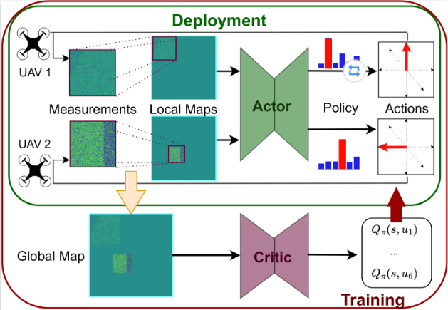

# Multi-Agent Reinforcement Learning for UAV Path Planning

基于 COMA (Counterfactual Multi-Agent Policy Gradients) 算法的多无人机协同路径规划项目。

## 📋 Requirements

```
matplotlib==3.5.1
numpy==1.22.2
opencv-python==4.5.5.62
scipy==1.8.1
torch==1.13.0+cu117
seaborn
tensorboard
```

### 安装依赖

```bash
# 使用 conda 环境 (推荐)
conda create -n marl python=3.9
conda activate marl
pip install torch==1.13.0+cu117 --extra-index-url https://download.pytorch.org/whl/cu117
pip install matplotlib numpy opencv-python scipy seaborn tensorboard
```

## 📁 项目结构

```
paper/
├── README.md                      # 本文件
├── marl_framework/               # 主代码目录
│   ├── configs/                  # ✨ 训练配置文件
│   │   ├── params.yaml           # 完整配置 (40-80h)
│   │   ├── params_balanced.yaml  # 平衡配置 (20-30h) ⭐推荐
│   │   ├── params_fast.yaml      # 快速测试 (10-15h)
│   │   └── README.md             # 配置说明
│   │
│   ├── scripts/                  # ✨ 可执行脚本
│   │   ├── train_with_backup.sh  # 主训练脚本 ⭐
│   │   ├── manage_training_history.sh
│   │   ├── run_training.sh
│   │   ├── fix_glibcxx.sh
│   │   └── README.md
│   │
│   ├── docs/                     # ✨ 项目文档
│   │   ├── CONFIG_SELECTION_GUIDE.md    # 配置选择指南
│   │   ├── GPU_BOTTLENECK_ANALYSIS.md   # GPU性能分析
│   │   ├── TRAINING_LOG_MANAGEMENT.md
│   │   ├── GPU_TRAINING_GUIDE.md
│   │   └── README.md             # 文档索引
│   │
│   ├── actor/                    # Actor网络 (策略网络)
│   ├── critic/                   # Critic网络 (价值网络)
│   ├── agent/                    # 智能体定义
│   ├── missions/                 # 训练任务流程
│   ├── mapping/                  # 地图环境
│   ├── sensors/                  # 传感器模拟
│   ├── utils/                    # 工具函数
│   │
│   ├── main.py                   # 训练入口 ⭐
│   ├── constants.py              # 全局常量
│   ├── coma_wrapper.py           # COMA算法封装
│   ├── batch_memory.py           # 经验回放
│   │
│   ├── log/                      # 当前训练日志 (会覆盖)
│   │   ├── best_model.pth
│   │   ├── events.out.tfevents.*
│   │   └── plots/
│   │
│   └── training_history/         # 历史训练备份 (永久保存)
│       ├── baseline/
│       │   ├── best_model.pth
│       │   ├── events.out.tfevents.*
│       │   ├── params_backup.yaml
│       │   └── metadata.txt
│       ├── production_v1/
│       └── exp_collision_2.0/
│
└── running/                      # 项目运行脚本
```


在任务期间的每个时间步长，每架无人机都会进行测量并更新其本地地图状态。本地映射输入到参与者网络，该网络输出从中采样作的策略。在训练过程中，使用全局地图信息额外训练一个集中的批评网络，并从当前状态输出每个动作的 Q 值，即预期的未来回报。


## 🚀 快速开始

### 1. Linux 服务器训练 (推荐)

```bash
# 进入项目目录
cd ~/paper_v2/paper/marl_framework

# 首次使用: 修复库依赖 (如果遇到 GLIBCXX 错误)
cd scripts
./fix_glibcxx.sh

# 使用平衡配置开始训练 (推荐)
CONFIG_FILE_PATH=configs/params_balanced.yaml ./train_with_backup.sh production_v1

# 使用快速测试配置
CONFIG_FILE_PATH=configs/params_fast.yaml ./train_with_backup.sh test_run

# 或使用完整配置 (最佳性能但耗时长)
CONFIG_FILE_PATH=configs/params.yaml ./train_with_backup.sh full_training
```

### 2. 监控训练

```bash
# 方式 1: 使用项目监控脚本 (推荐) ⭐
cd scripts
./monitor_training.sh

# 持续监控
watch -n 2 ./monitor_training.sh

# 方式 2: 使用 nvidia-smi
watch -n 1 nvidia-smi

# 方式 3: 查看详细 GPU 信息
nvidia-smi dmon -s pucvmet

# 方式 4: 查看训练日志
tail -f ../log/training.log
```

### 3. 查看训练结果

```bash
# 列出所有历史训练
cd scripts
./manage_training_history.sh

# 启动 TensorBoard 查看训练曲线
cd ..
tensorboard --logdir log/ --port 6006

# 或查看所有历史训练对比
tensorboard --logdir training_history/ --host 0.0.0.0 --port 6006
# 然后在浏览器访问: http://服务器IP:6006
```

### 自定义配置

# 复制现有配置
cp configs/params_balanced.yaml configs/params_custom.yaml

# 编辑配置 (例如调整 collision_weight)
nano configs/params_custom.yaml

# 使用自定义配置训练
cd scripts
CONFIG_FILE_PATH=configs/params_custom.yaml ./train_with_backup.sh exp_custom
```

## 📊 训练管理

### 自动备份机制

每次训练前会自动备份之前的结果:

```
training_history/
├── <实验名>/
│   ├── best_model.pth         # 最佳模型
│   ├── events.out.tfevents.*  # TensorBoard 日志
│   ├── params_backup.yaml     # 训练配置备份
│   ├── metadata.txt           # 实验元数据
│   └── plots/                 # 训练图表
```

### 管理历史记录

```bash
cd marl_framework/scripts

# 查看所有历史记录
./manage_training_history.sh

# 功能菜单:
# 1. 列出所有历史记录
# 2. 查看实验详情
# 3. 恢复历史模型
# 4. 删除旧记录
# 5. 对比不同实验
```

### 对比实验

```bash
# 启动 TensorBoard 对比所有实验
cd marl_framework
tensorboard --logdir training_history/ --host 0.0.0.0 --port 6006

# 在浏览器中查看:
# - 不同配置的收敛速度
# - 不同 reward weight 的效果
# - 模型性能对比
```

## 🔧 常见问题

### 问题 1: GPU 利用率很低 (<15%)

**原因**: CPU 数据预处理瓶颈 (actor/transformations.py)

**解决方案**: 
```bash
# 查看详细分析
cat docs/GPU_BOTTLENECK_ANALYSIS.md

# 短期方案: 使用 params_balanced.yaml (减少 budget)
# 长期方案: 重构数据准备流程为 GPU 操作 (需要代码改造)
```

### 问题 2: GLIBCXX 版本错误

**错误信息**: `version 'GLIBCXX_3.4.29' not found`

**解决方案**:
```bash
cd marl_framework/scripts
./fix_glibcxx.sh

# 查看详细说明
cat ../docs/GLIBCXX_FIX.md
```

### 问题 3: 找不到配置文件

**错误信息**: `FileNotFoundError: configs/params.yaml`

**解决方案**:
```bash
# 确认在正确的目录
cd marl_framework/scripts

# 使用相对路径
CONFIG_FILE_PATH=configs/params_balanced.yaml ./train_with_backup.sh exp1
```

### 问题 4: 训练太慢

**查看优化建议**:
```bash
cat docs/TRAINING_OPTIMIZATION.md
cat docs/CONFIG_SELECTION_GUIDE.md

# 推荐: 使用 params_balanced.yaml
# Budget=12 可以将训练时间减半,性能仅损失 5%
```

## 📚 文档索引

- **[configs/README.md](marl_framework/configs/README.md)** - 配置文件使用说明
- **[scripts/README.md](marl_framework/scripts/README.md)** - 脚本使用说明
- **[docs/README.md](marl_framework/docs/README.md)** - 完整文档索引
- **[docs/CONFIG_SELECTION_GUIDE.md](marl_framework/docs/CONFIG_SELECTION_GUIDE.md)** - 配置选择完整指南 ⭐
- **[docs/GPU_BOTTLENECK_ANALYSIS.md](marl_framework/docs/GPU_BOTTLENECK_ANALYSIS.md)** - GPU 性能瓶颈分析 ⭐
- **[docs/TRAINING_LOG_MANAGEMENT.md](marl_framework/docs/TRAINING_LOG_MANAGEMENT.md)** - 训练日志管理
- **[docs/GPU_TRAINING_GUIDE.md](marl_framework/docs/GPU_TRAINING_GUIDE.md)** - GPU 环境配置
- **[docs/GLIBCXX_FIX.md](marl_framework/docs/GLIBCXX_FIX.md)** - 库依赖问题解决

## 💡 最佳实践

### 推荐训练流程


# 1. 首次快速验证 (确认代码能跑通)
cd marl_framework/scripts
chmod +x *.sh && ls -lh *.sh  (初始使用需要给脚本配置权限)
CONFIG_FILE_PATH=configs/params_fast.yaml ./train_with_backup.sh quick_test
# 预期: 10-15 小时

# 2. 正式训练 (生产环境)
CONFIG_FILE_PATH=configs/params_balanced.yaml ./train_with_backup.sh production_v1
# 预期: 20-30 小时, 性能 93-95%

# 3. 最终模型 (可选,如果需要最佳性能)
CONFIG_FILE_PATH=configs/params.yaml ./train_with_backup.sh final_model
# 预期: 40-80 小时, 性能 100%

# 清理备份模型数据 ** 解决配置变更问题
./clean_models_for_new_config.sh
```

### 实验命名规范

```bash
# 推荐命名方式:
./train_with_backup.sh baseline_v1          # 基线版本
./train_with_backup.sh exp_collision_2.0    # 调整碰撞权重
./train_with_backup.sh exp_budget_12        # 调整 budget
./train_with_backup.sh production_20250123  # 生产环境版本
```

### 监控和调试


```bash
# 实时监控 GPU (推荐使用项目脚本)
cd marl_framework/scripts
# 使用 watch 持续监控
watch -n 2 './monitor_training_simple.sh'
# 直接运行,查看详细信息
./monitor_training.sh

# 或使用原生命令
watch -n 1 nvidia-smi

# 查看训练日志
tail -f ../log/training.log

# 检查 GPU 利用率
nvidia-smi dmon -i 0 -s pucvmet

# 查看进程详情
nvidia-smi pmon

# 启动 TensorBoard
cd ..
tensorboard --logdir log/ --port 6006
```


