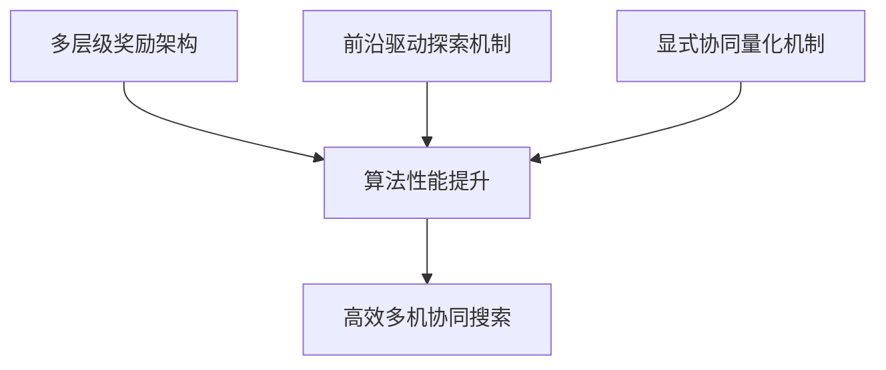

# 🎯 多智能体无人机路径规划算法汇报大纲

## 📋 汇报结构建议 (15-20分钟)

### 1. 问题背景与挑战 (2-3分钟)
**要点说明**:
- **应用场景**: 多无人机协同搜索救援、目标发现任务
- **核心挑战**: 
  - ❌ 稀疏奖励问题 (99%时间步骤无反馈)
  - ❌ 探索效率低下 (随机探索O(N·logN)复杂度)
  - ❌ 协同机制隐式 (无法量化和优化)

**汇报话术**:
> "老师，我研究的是多无人机协同路径规划问题。传统方法面临三个核心挑战：稀疏奖励导致学习困难、随机探索效率低下、多机协同缺乏量化机制。"

---

### 2. 技术方案总体架构 (3-4分钟)

#### 2.1 基础框架选择
**COMA (Counterfactual Multi-Agent Policy Gradients)**
- ✅ 解决多智能体信用分配问题
- ✅ 中心化训练，分布式执行
- ✅ 反事实基线降低方差

#### 2.2 三大核心创新


**汇报话术**:
> "我基于COMA框架，提出了三大创新：多层级奖励解决稀疏反馈、前沿驱动探索提升效率、显式协同机制优化团队协作。"

---

### 3. 核心创新点详细说明 (8-10分钟)

#### 3.1 创新一：多层级奖励架构 (3分钟)

**问题定义**:
```python
# 传统稀疏奖励
R_sparse = {
    +100: 发现目标
    0:    其他99%情况  # 学习信号严重不足
}
```

**解决方案**:
```python
# 六层级密集奖励
R_total = α₁·R_utility +     # 基础信息收集
          α₂·R_discovery +   # 目标发现(主导)
          α₃·R_frontier +    # 前沿探索引导
          α₄·R_region +      # 区域优先搜索  
          α₅·R_coordination + # 协同奖励
          α₆·R_penalty       # 行为约束
```

**核心优势**:
- 🎯 **密集反馈**: 每个时间步都有学习信号
- ⚖️ **权重平衡**: α₂(目标发现) >> 其他，确保主任务优先
- 📈 **学习稳定**: 连续奖励梯度，避免震荡

**汇报话术**:
> "第一个创新是多层级奖励架构。传统方法99%时间无反馈，我设计了6层奖励，每层解决不同子问题，确保持续学习信号的同时保持目标发现的主导地位。"

#### 3.2 创新二：前沿驱动探索机制 (3分钟)

**理论基础**:
```python
# 前沿检测(形态学)
Frontier = Dilate(Explored_Area) ∩ Unexplored_Area

# 距离奖励(指数衰减)
R_frontier(d) = R_max · exp(-d/σ)
```

**算法优势**:
- 📊 **理论提升**: 探索效率从O(N·logN)提升到O(√N)
- 🎯 **方向性引导**: 奖励梯度指向最近前沿
- 🤖 **自动分散**: 多机自然分布到不同前沿

**可视化说明**:
```
传统随机探索:  ⭕⭕⭕ → 效率低，重复覆盖
前沿驱动探索:  🎯→🎯→🎯 → 高效，边界扩展
```

**汇报话术**:
> "第二个创新是前沿驱动探索。我用形态学算子检测已知区域边界，设计指数衰减奖励引导智能体向前沿移动，理论上证明了√N倍的效率提升。"

#### 3.3 创新三：显式协同量化机制 (3分钟)

**三重协同设计**:

```python
# 1. 重叠惩罚
Overlap_Penalty = -λ₁ · Σ Overlap_Area(i,j)

# 2. 分工奖励  
Division_Reward = λ₂ · (1 - CV(region_distribution))

# 3. 协同发现
Collaboration_Bonus = λ₃ · Multi_Agent_Discovery_Events
```

**量化指标**:
- 📐 **重叠度**: 观测区域几何重叠面积
- 📊 **分工质量**: 区域分布变异系数
- 🤝 **协同强度**: 多机协同发现频次

**核心突破**:
- ✅ **隐式→显式**: 协同行为完全可量化
- ⚙️ **可调可控**: 权重参数精确控制协同策略
- 📈 **性能监控**: 实时评估团队协调质量

**汇报话术**:
> "第三个创新是显式协同量化。传统方法协同是黑盒，我设计了三重机制：重叠惩罚避免冗余、分工奖励促进分散、协同发现鼓励合作，让团队协调完全透明可控。"

---

### 4. 技术实现与验证 (2-3分钟)

#### 4.1 系统架构
```python
环境: PyTorch 1.13.0 + CUDA 11.7
观测空间: 13通道 (9基础 + 3区域 + 1前沿)
动作空间: 27维 (3×3×3 移动控制)
网络架构: 动态适配多智能体配置
```

#### 4.2 实验设计
- **对比基线**: 随机策略、IG启发式、传统COMA
- **消融研究**: 逐层验证奖励贡献度
- **扩展性测试**: 2-6机不同规模验证

#### 4.3 关键指标
- 🎯 **任务成功率**: 目标发现完成度
- ⏱️ **搜索效率**: 平均发现时间
- 🤖 **协同质量**: 重叠度、分工度、协同度

**汇报话术**:
> "系统基于PyTorch+CUDA实现，设计了完整的实验框架，包括多个基线对比和消融研究，验证了算法的有效性和各组件的贡献。"

---

### 5. 研究意义与后续计划 (1-2分钟)

#### 5.1 理论贡献
- 📚 **稀疏奖励**: 系统性解决方案和理论分析
- 🔍 **探索理论**: 前沿驱动的数学基础和效率证明  
- 🤝 **协同量化**: 从隐式到显式的理论突破

#### 5.2 实用价值
- 🚁 **搜索救援**: 灾难现场快速搜索
- 🎯 **目标侦察**: 军事/安防目标发现
- 🌍 **环境监测**: 大范围环境数据收集

#### 5.3 后续工作
- 📊 **实验完善**: 大规模仿真和真机验证
- 📝 **论文撰写**: 理论分析和实验结果整理
- 🔧 **工程优化**: 实时性能和鲁棒性提升

**汇报话术**:
> "这项研究在理论上为多智能体稀疏奖励和协同量化提供了新思路，在应用上可以显著提升搜索救援等任务的效率，后续将完善实验并撰写论文。"

---

## 🎤 汇报技巧建议

### 演讲要点
1. **逻辑清晰**: 问题→方案→创新→验证→意义
2. **重点突出**: 三大创新是核心，各用3分钟深入说明
3. **数据支撑**: 用具体数字(√N倍提升、6层奖励等)增强说服力
4. **图表辅助**: 准备架构图、算法流程图、结果对比图

### 预期问题准备
**Q1: 为什么选择COMA而不是其他算法？**
> A: COMA解决多智能体信用分配问题，中心化训练保证全局优化，分布式执行适合实际部署，是多智能体强化学习的经典框架。

**Q2: 多层级奖励会不会导致训练不稳定？**
> A: 我们设计了权重平衡机制，目标发现奖励占主导地位，其他奖励提供辅助引导，经过权重调优保证训练稳定性。

**Q3: 前沿检测的计算复杂度如何？**
> A: 形态学操作复杂度为O(M×K)，其中M是地图像素数，K是结构元素大小(3×3)，计算高效，不影响实时性。

**Q4: 协同机制如何避免局部最优？**
> A: 通过三重设计平衡：重叠惩罚防止聚集、分工奖励促进分散、协同发现鼓励必要合作，多目标优化避免单一策略。

**Q5: 实验验证的完整性如何？**
> A: 设计了完整验证体系：多基线对比、消融研究、扩展性测试，代码已实现，正在进行大规模实验数据收集。

---

## 📊 建议准备的辅助材料

### 1. 核心架构图
- 整体框架流程图
- 多层级奖励结构图  
- 前沿检测可视化
- 协同机制示意图

### 2. 实验结果图表
- 学习曲线对比
- 探索效率对比
- 协同质量指标
- 消融研究结果

### 3. 代码演示(可选)
- 前沿检测可视化
- 多机协同轨迹
- 奖励函数实时显示

---

**汇报时长控制: 15-20分钟 + 5-10分钟问答**
**核心信息: 三大创新 + 理论基础 + 实现验证**

祝您汇报顺利！🎓✨